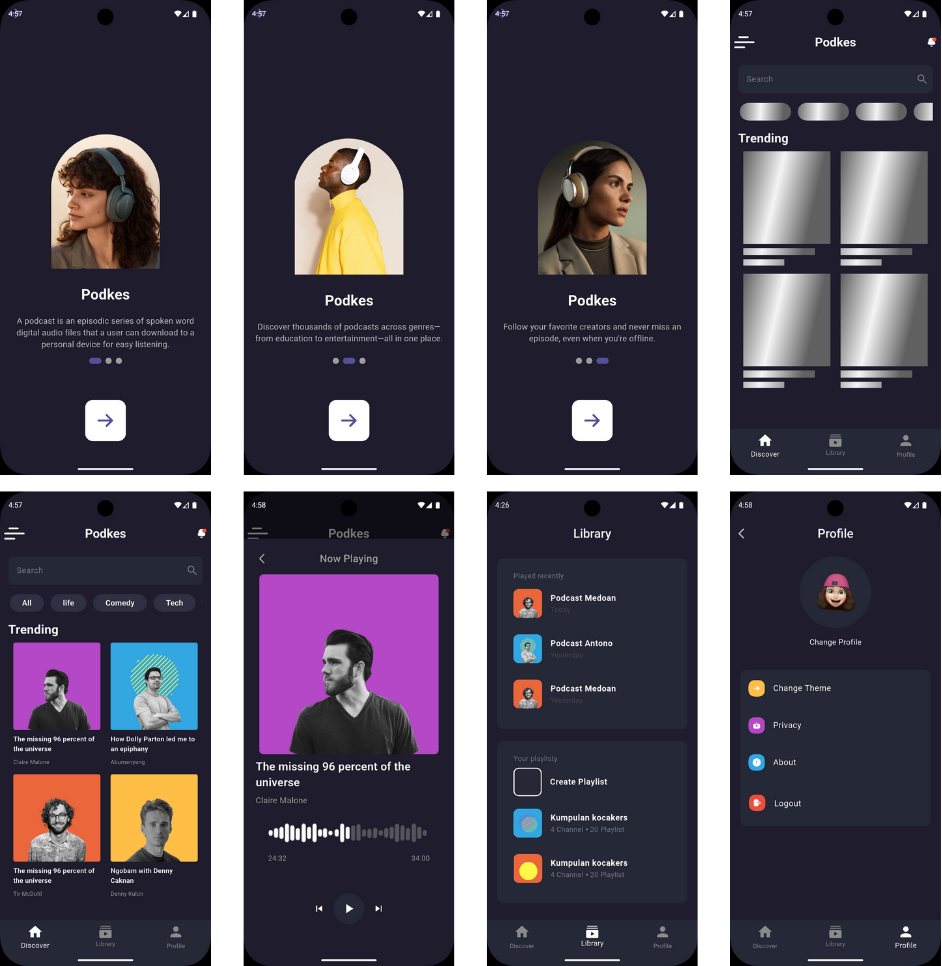

# 🎧 Podkes App

### Tuwaiq Academy Flutter Bootcamp

### 📘 Introduction

The goal of this project is to design and implement user interfaces for a Podcast style food delivery app using Flutter. The UI will be built by closely following a reference design provided via Figma [Podkes App Design](https://www.figma.com/design/RqcuinLb0RMD1yyZWS8ahR/Podcast-Mobile-App-(Community)?node-id=0-1&p=f&t=e3UCoP5bxaWjjdT4-0) to practice Flutter development and improve UI design implementation skills.

---
### 🔍 Project Preview





---
### ⚙️ Tech Stack
- **Flutter**
- **Dart**

---
### 💻  Setup instructions 

 1. Clone the repository:

```
https://github.com/RemasNg1/Podkes-App
```
2. Navigate to the project folder:

```
cd Podkes-App/podkes_app
```

3. Install dependencies:
```
flutter pub get
```

 4. Run the app:
 ```
 flutter run 
 ```  

---
### 📂 Folder Structure 

```
lib


   ├── main.dart
   ├── widgets
   │   ├── listtile_widget.dart
   │   ├── podcast_thumbnail_widget.dart
   │   ├── sheet_bottom_widget.dart
   │   ├── shimmer_listtile_widget.dart
   │   └── shimmer_podcast_thumbnail_widget.dart
   └── screens
       ├── bottom_nav_screen.dart
       ├── explore_screen.dart
       ├── library_screen.dart
       ├── profile_screen.dart
       └── started_screen.dart


       
```


---
### 🖊️ Author
Remas Alnugaithan


