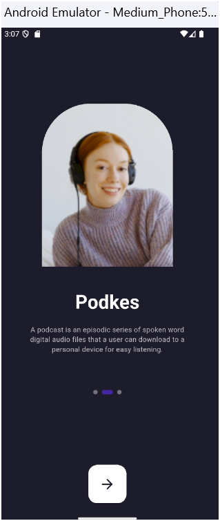
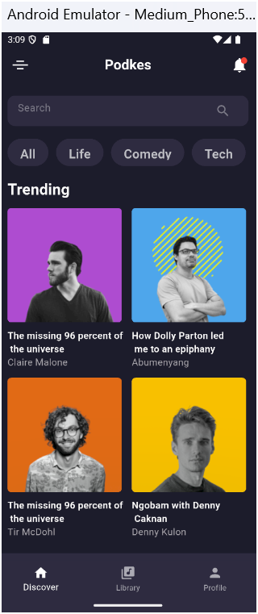
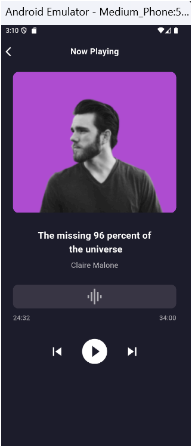
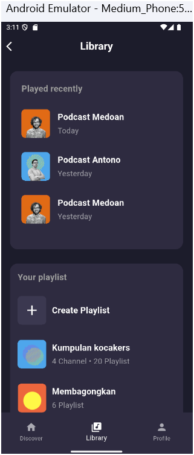
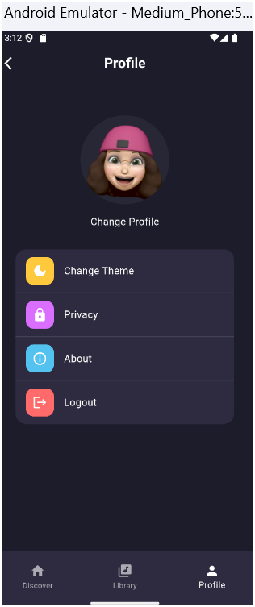
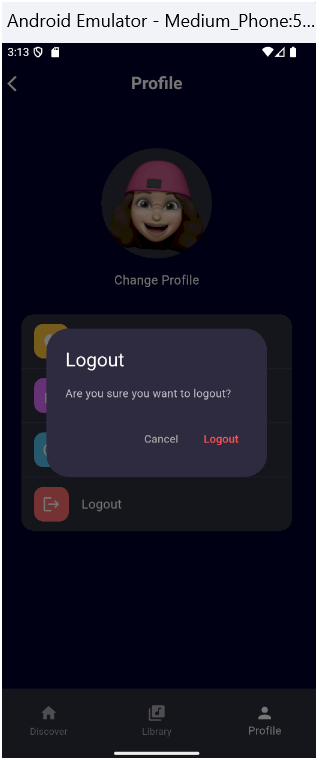

# 🎧Podkes App

# Project description

Flutter-based mobile application designed for podcast enthusiasts, offering a user-friendly interface to explore, listen to, and manage podcasts across various genres. It features a bottom navigation bar for easy access to sections like Discover, Library, and Profile, along with a search bar for quick podcast searches. Users can view recently played episodes, create and manage playlists, and customize their profiles. The Now Playing screen showcases the currently playing podcast with album art and audio controls. With visually appealing loading indicators and a focus on seamless navigation, Podkes enhances the overall podcast listening experience for users of all ages.

# 🎨Setup instructions

1-Clone the repository Through commands line:git clone Your Own path

2-Install dependencies Make sure you have Flutter installed. Then run:flutter pub get

3-Run the app You can launch the app using. Then run: flutter run

Note: You need a working emulator or a connected real device.

# 🎯Design Objectives

✅ Deliver a visually appealing, clutter-free UI

✅ Ensure consistent spacing, font sizing, and component alignment

✅ Prioritize fast and fluid navigation

✅ Optimize for both usability and visual engagement

✅ Design scalable components for future feature additions

 # 📱Screen Design Overview
 

# Started Screen

# Explore  & Main Navigation Screen

# Author Music Screen

# Library Screen

# Profile  Screen

# Logout  Alert

