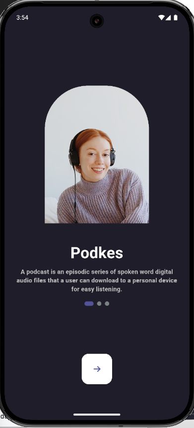
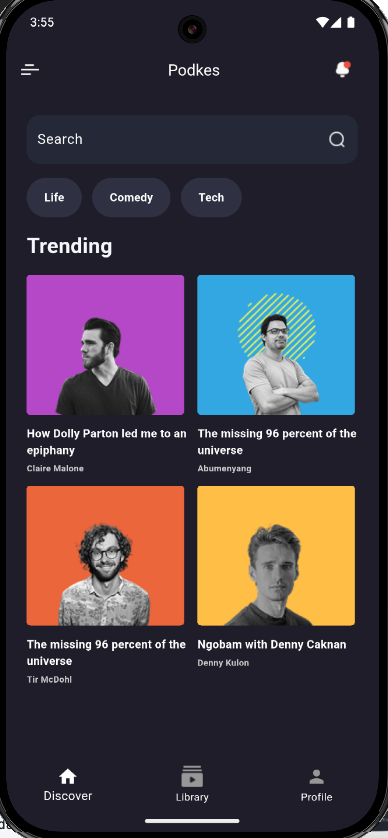
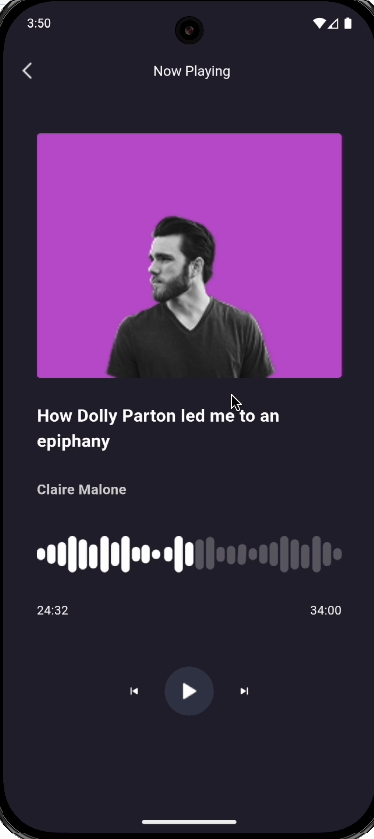
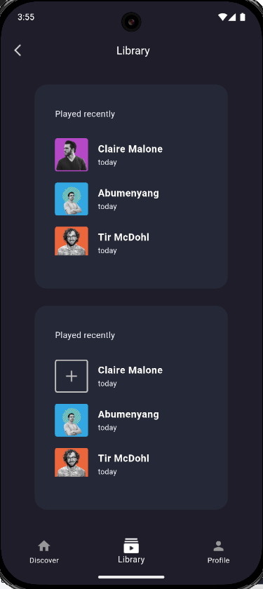
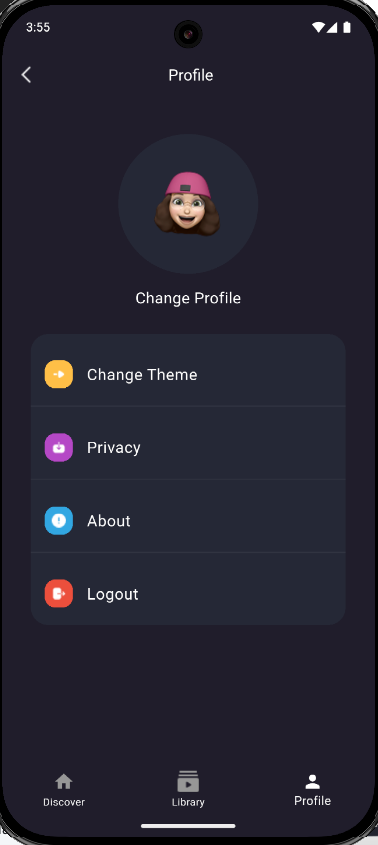

# 🎧 Podkes - Flutter Podcast App UI

A beautifully designed podcast app UI built with Flutter, inspired by a Figma prototype. This implementation features smooth animations, responsive layouts, and modern UI components following MVC architecture.

## ✨ Key Features

- **MVC Architecture** - Clean separation of concerns
- **Reusable Components** - Modular widget design
- **Smooth Animations** - Page transitions and interactive elements
- **Shimmer Effects** - Elegant loading states
- **Responsive Design** - Adapts to various screen sizes

## 📱 Screenshots & Preview


### App Screens

<table>
  <tr>
    <td align="center"><strong>Onboarding</strong></td>
    <td align="center"><strong>Discover</strong></td>
    <td align="center"><strong>Now Playing</strong></td>
    <td align="center"><strong>Library</strong></td>
    <td align="center"><strong>Profile</strong></td>
  </tr>
  <tr>
    <td></td>
    <td></td>
    <td></td>
    <td></td>
    <td></td>
  </tr>
</table>

## 🛠 Technical Highlights

### Core Functionality
- **Navigation System**
  - Bottom navigation bar with 3 main tabs
  - Custom animated transitions between screens
  - State-preserving navigation

### UI Components
- **Shimmer Loading Effects**
  - Podcast card placeholders
  - Profile avatar loading state
- **Custom Dialogs**
  - Logout confirmation dialog
  - Consistent styling across all popups

### Architecture
- **MVC Pattern**
  - Clear separation between business logic and presentation
  - Controllers for state management
  - Reusable view components

## 📂 Project Structure

```plaintext
lib/
├── controllers/
│   ├── circlerDot_controller.dart
│   ├── home_controller.dart
│   └── onBording_controller.dart
├── models/
│   ├── category_model.dart
│   ├── music_model.dart
│   └── onbording_model.dart
├── views/
│   ├── details_music_view.dart
│   ├── home_view.dart
│   ├── library_view.dart
│   ├── onBording_view.dart
│   └── profile_view.dart
├── widgets/
│   ├── circleDot_widget.dart
│   ├── mainButton_widget.dart
│   ├── home_widgets/
│   │   ├── card_music_widget.dart
│   │   ├── category_widget.dart
│   │   └── leading_home_widget.dart
│   ├── library_widgets/
│   │   ├── card_playlist_widget.dart
│   │   └── container_playlist_widget.dart
│   ├── navbar_widget/
│   │   └── navBar_widget.dart
│   ├── onbording_widgets/
│   │   └── onBording_widget.dart
│   ├── profile_widgets/
│   │   ├── card_profile_widget.dart
│   │   └── showLogoutDialog_widget.dart
│   └── shimmer_widgets/
│   │   ├── shimmerCardMusicWidget.dart
│   │   └── shimmer_avatar.dart
│   ├──circleDot_widget.dart
│   ├──mainButton_widget.dart
│   └─ contanier_image.dart
│──MainApp.dart
└── main.dart
plaintext```
## 🎨 Design Reference

The UI is implemented from the original Figma design:

🔗 [Podkes Figma Design](https://www.figma.com/design/YDFOISOftjHWDYC9i6P6T8/Podcast-Mobile-App--Community-?node-id=0-1&p=f&t=O1RhQR7hpHC0b93Z-0)

