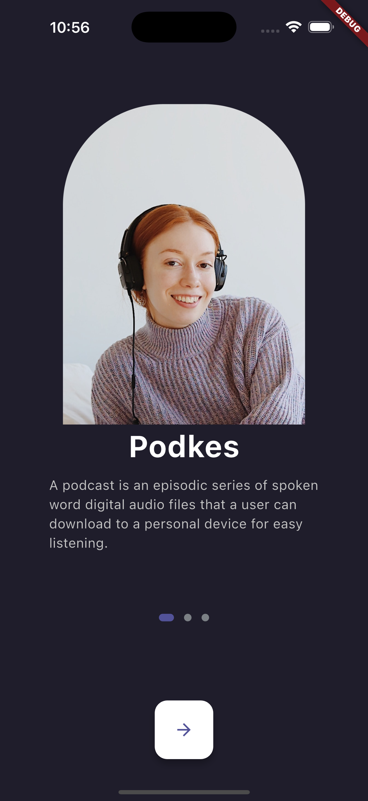
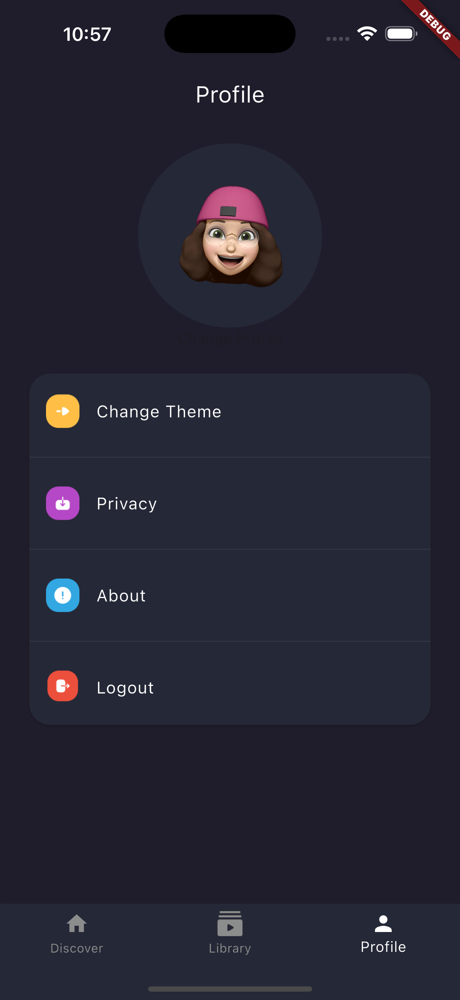

# Pdkes App UI

The UI design of a great podcast/music listening app.

## Screenshots

### Onboarding Screen  


### Profile Screen


## Features

- **Onboarding Flow**  
  - Visually appealing welcome screens to introduce the app's features and value proposition.

- **Home Screen with Drawer**  
  - A side drawer for easy navigation to settings, profile, and more.
  - User profile picture displayed on the top right for quick identity reference.

- **Podcast Categories & Items**  
  - Scrollable sections for browsing Podcast categories.
  - Smooth UI transitions and structured layout for easy food discovery.
**Podcast Categories & Items**  
- Smooth Profile design that aims for usability and a clean look. 

## Tech Stack

- **Flutter** (latest stable version)  
- **Dart**

## Installation

1. Clone the repository:
   ```bash
   git clone https://github.com/your-username/your-repo-name.git
2. Navigate to the project directory:
    ```bash
    cd your-repo-name
3. Install dependencies:
    ```bash
    flutter pub get
4. Run the app:
    ```bash
    flutter run
## How to use:
- Launch the app to view the onboarding screens.

- Once logged in, access the Home Screen with categorized Podcast listings.

- Tap the bottom navigation bar icons for navigation and settings.

- Click the podcast and categories you want to listen to.

## *Solaiman Al-Dokhail*

### Note: I slept while working mistakingly so I couldn't finish it or wake up early and finish it since my phone died. I hope that you understand🙏🏻❤️.

