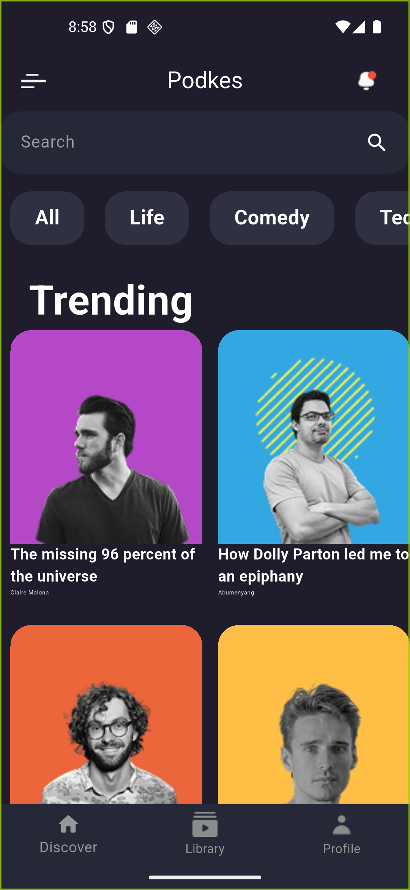
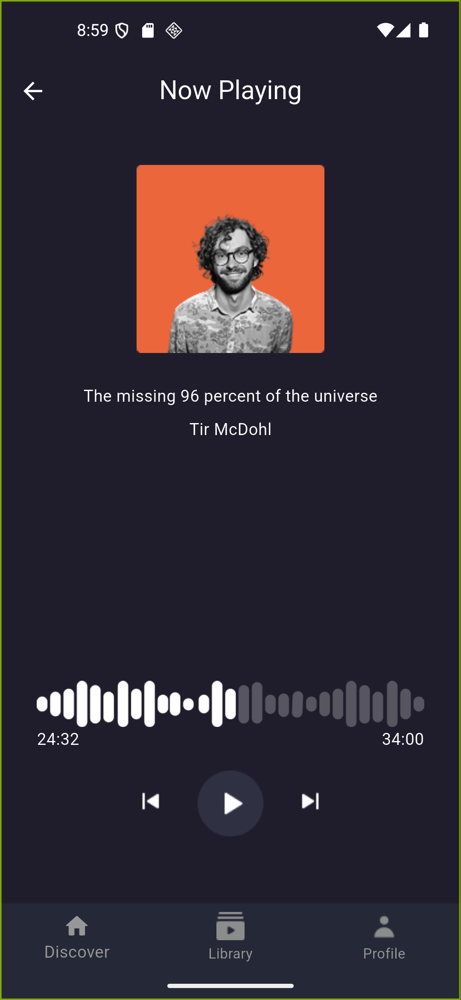

# ⚫Podkes-App 

A beautiful Flutter app for listening to podcasts and music

---

## Screenshots








---

##  Features

- Display albums 🎶
- Listen to the podcast 🎶
- Customize a playlist 🎶
- Bottom navigation bar.
- Smooth and responsive UI design.

---

## Tech Stack

- Flutter
- Dart

---

## Installation

1. Clone the repository:

```bash
git clone https://github.com/Ahmed-Almansour99/Podkes-App.git

cd Podkes-App

cd podkes_app

flutter pub get

flutter run
```


## How to Use
Launch the app.

Browse through the list of popular Podcast.
Listen to the most popular Podcast now


## Author

github : Ahmed-Almansour99
 

