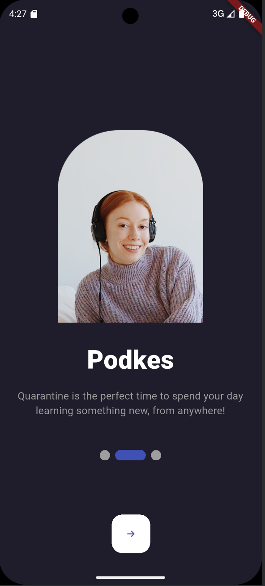
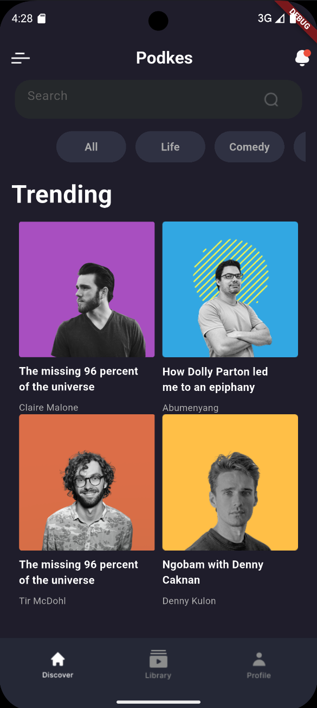
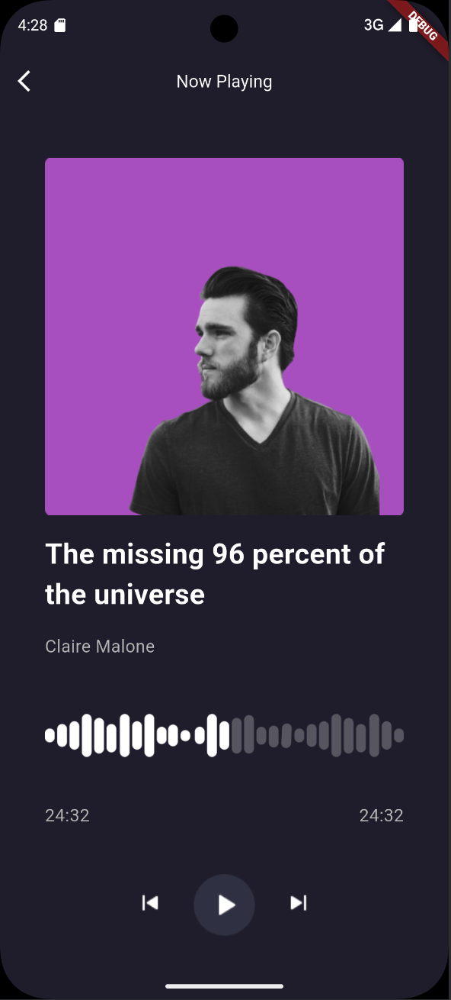
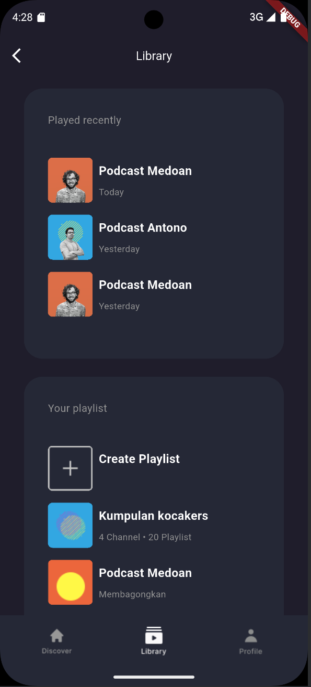

# 🎧 Podkes – Flutter Podcast App

 


---

## 📱 Screenshots

| Explore | Library | Profile |
|------|---------|---------|
|  |  |  |


---

## 🎯 Objective

The goal is to implement a **clean, animated, and responsive UI** for a podcast app using Flutter.  
Focus areas include:

- UI fidelity based on the provided design
- Performance and responsiveness
- Clean architecture and component-based development

---

## 🎨 Figma UI Design

You can find the design reference here:

👉 [Figma Link – Podcast App Design](https://www.figma.com/design/RqcuinLb0RMD1yyZWS8ahR/Podcast-Mobile-App--Community-?node-id=0-1&p=f&t=5JfcOIWwuqpPmLqn-0)

---

## ✨ Key Features

### 🔻 Bottom Navigation Bar
- **Tabs**: Discover, Library, Profile
- Active tab highlights with icon and label change

### ✨ Shimmer Effect
- Custom shimmer loading widgets for:
  - Podcast thumbnails
  - Profile placeholders

### 🧾 Dialogs and Sheets
- Logout confirmation with `AlertDialog`
- Consistent and themed dialogs

---

## 🚀 How to Run

```bash
git clone https://github.com/yourusername/podkes_app.git
cd podkes_app
flutter pub get
flutter run
```


---

## 📁 Project Structure

```
/lib
  ├── screens/
  ├── widgets/
  ├── models/
  ├── utils/
  └── main.dart
```

---


🗓 **Deadline:** May 8, before 10:00 AM

---

## 💬 Final Note

> _"Design is not just what it looks like and feels like. Design is how it works." – Steve Jobs_

Happy coding! 🎉
